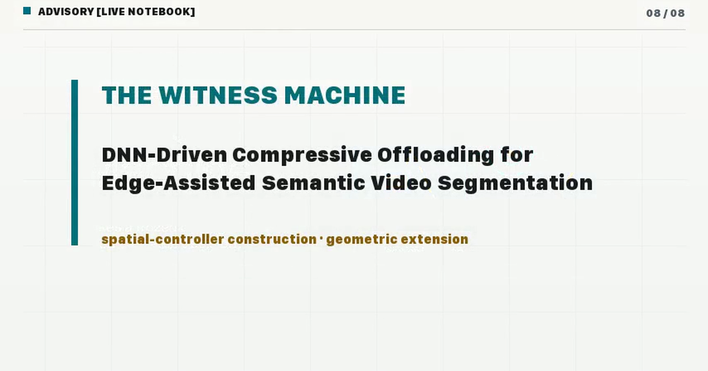

# The Witness Machine

**Shadow-price-guided SDF level-set compression for frozen driving perception**

[Run the notebook in molab](https://molab.marimo.io/github/adpena/witness-machine/blob/main/notebooks/witness_machine_v12.py)
· [Source](https://github.com/adpena/witness-machine)
· [V1.2.0-rc2 release candidate](https://github.com/adpena/witness-machine/releases/tag/v1.2.0-rc2)



What is the smallest decoded video that makes a frozen driving-perception
receiver reach the same decision? This runnable marimo notebook implements the
first-order bounded-loss spatial controller from **DNN-Driven Compressive
Offloading for Edge-Assisted Semantic Video Segmentation** (STAC,
arXiv:2203.14481), then asks which compact geometric coordinate should carry
that debt.

Move one global loss budget through the controller; make a boundary-only policy
tie and then lose to uniform allocation; move an SDF wall and watch its exact
area and first variation change together. A locked frozen-SegNet pair keeps the
synthesis honest. No exact comma.ai score is claimed.

## Run the notebook

From the extracted `witness_machine_v12` directory:

```bash
python -m venv .venv
source .venv/bin/activate
pip install -e .
marimo run notebooks/witness_machine_v12.py --headless
```

For a finite execution smoke instead of a live server:

```bash
marimo export html notebooks/witness_machine_v12.py \
  --no-include-code --force -o /tmp/witness-machine-smoke.html
```

`RELEASE_MANIFEST.json` records every shipped source byte. The fuller research
archive adds the manuscript, locked figures, review packet, and reproducibility
reports. The compact release excludes the challenge video, scorer weights,
private run directories, and upstream source mutations. Rebuilding the release
archives and repository-wide gates require the source repository.

## Authority boundary

Public claims use `TOY`, `ADVISORY`, `EMPIRICAL`, `DERIVATION`, `EXTERNAL`,
`EXACT-CANDIDATE`, or `EXACT`. No `EXACT` score is available without an exact
score card tied to exact archive bytes and an unmodified upstream evaluator
transcript. Operator GO for the public source and release was received on July
10, 2026; identity, passwords, MFA, CAPTCHAs, and contest-form confirmation
remain account-holder actions.

MIT licensed. Built in public by `adpena`.
